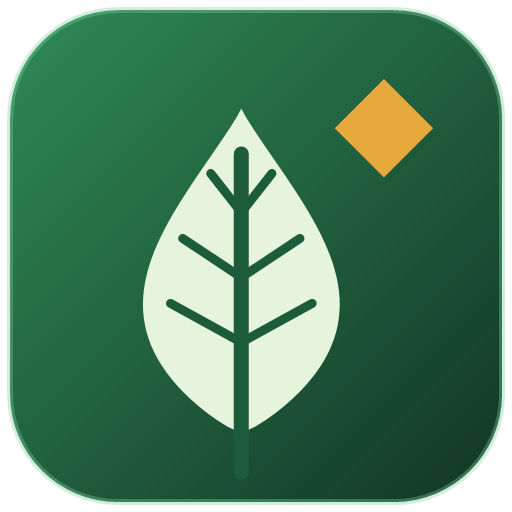

<p align="center">
  
</p>

<h1 align="center">Green Hell Companion</h1>

<p align="center">
  Mod de ajuda para <b>Green Hell</b>, em português. Mostra o que está acontecendo com você e o que fazer,
  sem trapacear: não altera status, não cria itens e não teleporta.
</p>

<p align="center">
  <a href="https://github.com/carvalhoofelipe/Greenhell-Companion/releases/latest"><b>Baixar a versão mais recente</b></a>
</p>

---

## O que o mod faz

| | |
|---|---|
| **Macroelementos** | Uma barra por linha, no mesmo estilo da vida e da energia, logo acima delas: proteína, gordura, carboidrato e água, com as cores e os ícones do jogo. A barra pisca em vermelho quando o nível está crítico. Assim você não precisa olhar o relógio. |
| **Avisos de saúde** | Quando aparece um ferimento, infecção, doença ou status baixo, um cartão no canto inferior esquerdo, logo acima dos macroelementos, diz o que é, onde está, o que causou e quais tratamentos o jogo aceita. Os itens que você já tem na mochila aparecem marcados. Exemplo: *"Laceração de felino · braço esquerdo · sangrando · causado por onça"*, com Formigas ✓ 3 na mochila, Curativo de cinzas ✕ não tem. |
| **Menu de construção** | Tecla F5. Todas as construções e receitas de criação que você conhece, por grupo (abrigos, fogo, água, armadilhas, ferramentas, armas, curativos…), no formato `Galho 13 (8)`: o necessário e, entre parênteses, quanto você tem na mochila. O número fica **verde** quando dá e **vermelho** quando falta. Tem busca por nome ou material, filtro "só o que dá para fazer agora" e botão **Posicionar** para começar a construir. |
| **Dicas** | Olhe para água, frutas, larvas, cogumelos, carne ou animais e aparece uma dica no canto superior direito. Exemplo: *"Água (insalubre): consumir esta água pode causar parasitas (50% de chance por gole). Ferva antes."* Para comida: o que pode causar, o que cura, quanto alimenta, se está crua ou estragada. Para animais: o perigo e a melhor arma; para animais abatidos, o que rendem ao esfolar. Os números vêm do próprio jogo. Dá para desligar no F4. |
| **Ajuda de construção** | No canto superior direito: ao posicionar uma construção, ou perto de uma já colocada, mostra cada material, quanto você tem (mochila, mãos e baús a até 20 m) e o que ainda falta. |
| **Marcadores** | Marque o lugar para onde você está olhando e dê um nome. O marcador ativo fica no topo da tela com distância, direção e coordenadas no mesmo formato do relógio do jogo (ex.: `21'W 34'S`). Cada partida tem seus próprios marcadores. Quando você morre, o mod cria sozinho o marcador vermelho **Seu loot**, com o símbolo de uma caveira, onde você caiu e o deixa ativo: no multiplayer a mochila fica nesse lugar, então é só seguir a distância e a direção para recuperar tudo. |
| **Guia dentro do jogo** | 230 fichas pesquisáveis sobre animais, ferimentos, doenças, plantas, armas, ferramentas, comida, abrigo e armadilhas, com as soluções em ordem do melhor ao de emergência. |
| **Visual do jogo** | Os cartões usam a mesma faixa de pincel e a mesma fonte do aviso "Caderno: Nova entrada" do jogo, com texto branco e sombra, sem caixas. Dá para voltar às caixas no F4. |
| **Configurações** | Tamanho do texto, transparência dos cartões e das ilustrações, animações e liga/desliga de cada parte (inclusive os macroelementos). |

### Teclas

| Tecla | Ação |
|---|---|
| `F1` | Abre o guia. Se houver um aviso de saúde na tela, abre direto na ficha dele. |
| `F2` | Marca o ponto para onde você está olhando. |
| `F3` | Lista de marcadores: mostrar no topo, renomear, apagar. |
| `F4` | Configurações. |
| `F5` | Menu de construção e criação. |
| `Esc` | Fecha a janela do mod. |

As teclas F1 a F4 não são usadas pelo jogo. Dá para trocá-las nas configurações do BepInEx (veja abaixo).

---

## Como instalar

Baixe na página de [**Releases**](https://github.com/carvalhoofelipe/Greenhell-Companion/releases/latest) um dos dois arquivos:

### Opção 1: arquivo `.zip` (recomendado)

Funciona em qualquer Windows, porque não executa nenhum programa.

1. Feche o Green Hell.
2. Abra a pasta do jogo: **Steam > Biblioteca > botão direito em Green Hell > Gerenciar > Ver arquivos locais**. É a pasta que tem o `GH.exe`.
3. Extraia **todo** o conteúdo do `.zip` dentro dessa pasta. Se perguntar, escolha **Substituir**.
4. Abra o jogo e entre numa partida.

Depois de extrair, a pasta do jogo deve ter o `winhttp.dll` ao lado do `GH.exe` e a pasta `BepInEx\plugins\GreenHellCompanion`.

> Já usa outros mods com BepInEx 5? Copie só a pasta `BepInEx\plugins\GreenHellCompanion` para o `BepInEx\plugins` do seu jogo.

### Opção 2: instalador `.exe`

1. Feche o Green Hell e abra o `GreenHellCompanion-Setup-x.x.x.exe`.
2. O instalador encontra a pasta do jogo pela Steam. Se não encontrar, clique em **Procurar** e escolha a pasta que tem o `GH.exe`.
3. Ele instala o BepInEx (se ainda não houver) e o mod. Depois aparece em *Adicionar ou remover programas*.

O instalador ainda não tem assinatura digital, por isso o Windows pode avisar:

- **"O Windows protegeu o computador" (SmartScreen):** clique em **Mais informações > Executar assim mesmo**.
- **"Controle Inteligente de Aplicativos bloqueou":** nesse caso o Windows não deixa abrir. Use a opção 1, o `.zip`.

### Multiplayer

Cada jogador instala no próprio PC. O mod só lê informações do seu personagem e não mexe na partida, então quem tem e quem não tem jogam juntos normalmente.

---

## Configurações

Aperte `F4` no jogo para ajustar o tamanho do texto e a transparência. As mudanças aparecem na hora.

Todas as opções, inclusive as teclas, também ficam em `Green Hell\BepInEx\config\br.felipe.greenhellcompanion.cfg`, criado na primeira vez que o jogo abre com o mod. Os marcadores ficam em `Green Hell\BepInEx\config\GreenHellCompanion\`, um arquivo por partida.

## Como remover

- **Instalado pelo `.exe`:** *Configurações do Windows > Aplicativos > Green Hell Companion > Desinstalar*.
- **Instalado pelo `.zip`:** apague a pasta `BepInEx\plugins\GreenHellCompanion`.

Para desligar todos os mods do jogo, apague o `winhttp.dll` da pasta do jogo.

## Problemas?

1. Confira se o `winhttp.dll` está na **mesma** pasta do `GH.exe`.
2. Abra o jogo uma vez e veja se apareceu o arquivo `BepInEx\LogOutput.log`. Se ele não aparecer, o carregador de mods não está ativo.
3. Se ele existir, procure por `Green Hell Companion` dentro dele.

Abra uma [issue](https://github.com/carvalhoofelipe/Greenhell-Companion/issues) com o conteúdo do `LogOutput.log` e o que aconteceu.

> Esta é a primeira versão. Se algum aviso, número ou receita estiver errado, conte na issue qual ficha e o que você viu no jogo.

---

## Guia no navegador

O mesmo conteúdo do guia funciona como site: abra o `index.html` deste repositório no navegador. Dá para deixar aberto no celular enquanto joga.

---

## Para quem quer mexer no código

```
dados/              Fichas do guia (fauna, saúde, itens) em JSON
montar-dados.mjs    Junta dados/*.json em dados.js (site) e mod/Data/guia.json (mod)
index.html          Site do guia
mod/                Plugin BepInEx 5 em C# (net472)
  src/              Saude, Construcao, Marcadores, JanelaGuia, JanelaConfig...
  Data/             guia.json e silhuetas em img/
instalador/         Inno Setup, logo e script que gera o .exe e o .zip
```

### Requisitos

- [.NET SDK 8](https://dotnet.microsoft.com/download)
- Green Hell com o [BepInEx 5](https://github.com/BepInEx/BepInEx/releases) instalado. O projeto compila contra as DLLs da sua instalação do jogo; nada do jogo vai para o repositório.
- [Node.js](https://nodejs.org) para gerar os dados do guia.
- [Inno Setup 6](https://jrsoftware.org/isinfo.php) só para gerar o instalador.

### Compilar e instalar no seu jogo

```powershell
node montar-dados.mjs                      # depois de editar dados/*.json
cd mod
dotnet build -c Release                    # compila e copia para BepInEx\plugins do jogo
dotnet build -c Release -p:GamePath="D:\Jogos\Green Hell"   # se o jogo estiver em outra pasta
```

### Gerar o instalador e o .zip

```powershell
powershell -ExecutionPolicy Bypass -File instalador\montar-instalador.ps1 -Versao 1.0.1
```

Os arquivos saem em `instalador\saida\`. O script baixa o BepInEx oficial na primeira vez.

### Como o mod funciona

O mod lê o estado do jogo diretamente das classes do Green Hell: `PlayerInjuryModule` (ferimentos), `PlayerDiseasesModule` (doenças), `PlayerConditionModule` (status), `ConstructionGhost` (construções), `InventoryBackpack` (mochila) e `Player.GetGPSCoordinates` (coordenadas). A tabela de tratamentos dos avisos é a mesma que o jogo usa para decidir o que pode ser aplicado em cada ferimento. A interface é desenhada com IMGUI. O único patch (Harmony) impede que o `Esc` abra o menu de pausa enquanto uma janela do mod está aberta.

---

## Créditos e licenças

- **Textos do guia** (`dados/`, `mod/Data/guia.json`): adaptados e traduzidos da [Green Hell Wiki](https://greenhell.fandom.com), licença [CC BY-SA 3.0](https://creativecommons.org/licenses/by-sa/3.0/). Esses textos seguem a mesma licença.
- **Silhuetas de animais**: [PhyloPic](https://www.phylopic.org), domínio público (CC0 1.0 / Public Domain Mark). Lista com autores em [`mod/Data/img/CREDITOS.md`](mod/Data/img/CREDITOS.md).
- **BepInEx** (carregador de mods, incluído nos downloads): [BepInEx](https://github.com/BepInEx/BepInEx), licença LGPL 2.1.

Green Hell é uma marca da Creepy Jar. Este é um projeto de fã, sem relação com a Creepy Jar.
